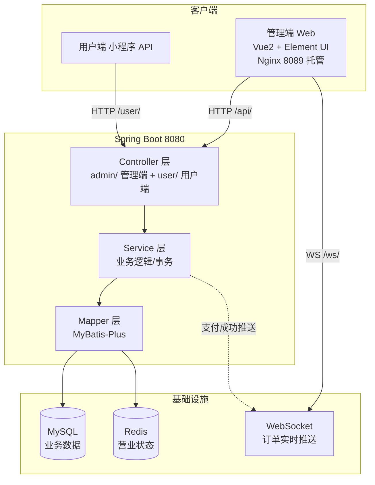
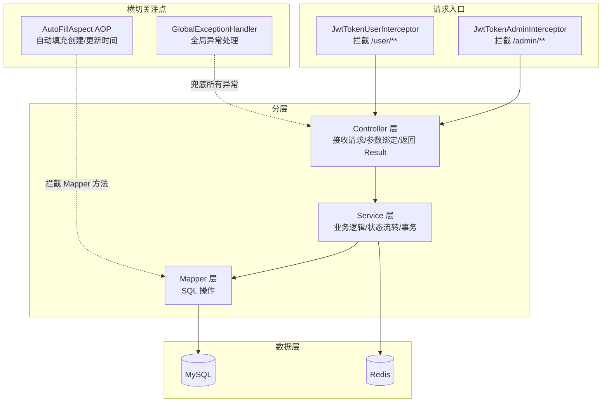
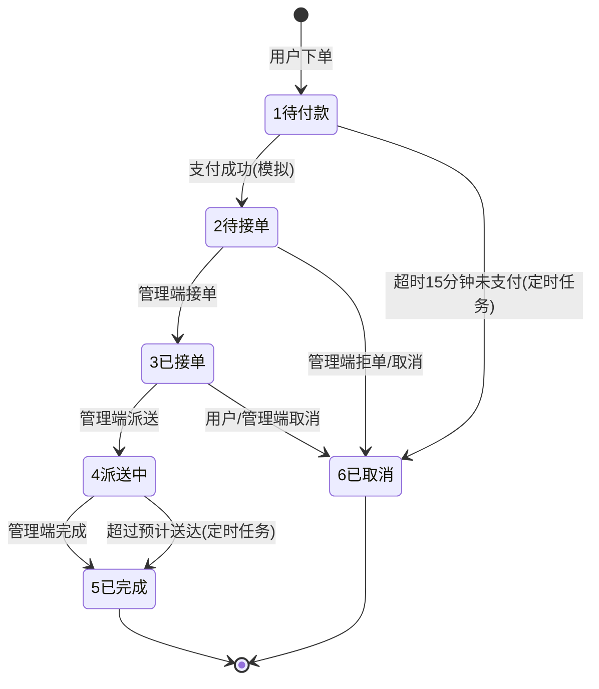

# 苍穹外卖 (Sky Take-Out)

> 一个基于 **Spring Boot 2.7 + Vue 2 + MySQL + Redis** 的完整外卖点餐系统，包含 **管理端**（网页后台）与 **用户端**（小程序 API）。
>
> 本项目为个人学习与求职项目，在经典课程项目基础上**扩展了报表统计、消息中心、WebSocket 实时通知、定时任务、Excel 导出**等模块，并修复了多个真实业务 Bug。

---

## 📌 项目简介

苍穹外卖是面向"外卖点餐"场景的经典前后端分离项目：

- **管理端**（Web）：员工登录、分类/菜品/套餐管理、订单管理（接单/拒单/派送/完成）、数据统计、消息中心、营业状态设置
- **用户端**（API）：微信登录、浏览菜品、购物车、下单支付、历史订单、订单详情、催单、地址簿

项目采用 **Maven 多模块 + 三层架构**，后端核心分层为 Controller → Service → Mapper，使用 JWT 做登录认证、AOP 做公共字段自动填充、WebSocket 做订单实时推送、定时任务做订单超时兜底与店铺自动开关。

---

## 🛠 技术栈

| 分类 | 技术 | 说明 |
|---|---|---|
| 后端框架 | Spring Boot 2.7.3 | 基础框架 |
| ORM | MyBatis-Plus 3.5 | 数据库操作 + 分页插件 |
| 数据库 | MySQL 8.0 | 业务数据存储 |
| 缓存 | Redis | 营业状态等热点数据 |
| 认证 | JWT + 拦截器 | 管理端 / 用户端双端认证 |
| 实时通信 | WebSocket | 订单状态实时推送 |
| 定时任务 | Spring @Scheduled | 超时取消 / 自动完成 / 店铺开关 |
| AOP | AutoFillAspect | 创建/更新时间自动填充 |
| 报表 | Apache POI | 运营数据 Excel 导出 |
| API 文档 | Knife4j | 接口调试 |
| 前端 | Vue 2 + TypeScript + Element UI | 管理端（vue-cli 3 / webpack 4） |

---

## 🏗 系统架构图

### 总体架构



### 后端分层架构



### 订单状态机



> 📖 更多架构图（下单流程时序、消息中心、定时任务、报表导出、登录认证等）见 [docs/architecture.md](docs/architecture.md)

---

## 🏗 项目结构

```
sky-take-out
├── sky-common                    # 公共模块：常量、异常、统一返回、工具类
│   ├── constant                  # 状态常量（订单状态、启用状态等）
│   ├── context                   # ThreadLocal 上下文（当前登录用户）
│   ├── exception                 # 自定义业务异常
│   ├── result                    # 统一返回结果 Result / PageResult
│   ├── properties                # JWT 等配置属性
│   └── utils                     # 工具类（JWT 生成校验等）
│
├── sky-pojo                      # 数据模型模块（纯 POJO）
│   ├── entity                    # 数据库表实体（Orders / Dish / User / Message...）
│   ├── dto                       # 前端传入参数对象
│   └── vo                        # 返回给前端的数据对象
│
└── sky-server                    # 业务模块（核心）
    ├── controller                # 接口层（admin/ 管理端 + user/ 用户端）
    ├── service                   # 业务逻辑层
    │   └── impl                  # 业务实现
    ├── mapper                    # 数据访问层（MyBatis-Plus）
    ├── config                    # 配置类（Redis / WebSocket / MyBatis-Plus / WebMvc）
    ├── interceptor               # JWT 拦截器（双端）
    ├── aspect                    # AOP 切面（公共字段自动填充）
    ├── handler                   # 全局异常处理器
    ├── task                      # 定时任务（订单超时 / 店铺开关）
    └── websocket                 # WebSocket 服务端

project-sky-admin-vue-ts          # 管理端前端（Vue2 + TS，独立仓库）
```

### 后端分层架构

```
浏览器 / 小程序
      ↓  HTTP 请求 (JSON)
 Controller 层   ← 接收请求、参数绑定、返回统一结果
      ↓
 Service 层      ← 业务逻辑、事务管理、状态流转
      ↓
 Mapper 层       ← MyBatis-Plus 操作数据库
      ↓
 MySQL / Redis
```

---

## ✨ 功能清单

### 管理端（Web 后台）

| 模块 | 功能 |
|---|---|
| 登录认证 | JWT 登录 / 退出 / 修改密码 |
| 工作台 | 今日营业额、有效订单、订单完成率、平均客单价、新增用户、订单/菜品/套餐概览 |
| 订单管理 | 条件分页查询、详情、接单、拒单、取消、派送、完成、状态统计 |
| 菜品管理 | 分页、增删改查、起售停售、图片上传 |
| 套餐管理 | 分页、增删改查、起售停售 |
| 分类管理 | 菜品/套餐分类增删改查 |
| 员工管理 | 分页、增删改查、启停用 |
| 数据统计 | 营业额/用户/订单按日趋势图、销量 TOP10、数据概览 |
| 报表导出 | 运营数据 Excel 导出（POI） |
| 消息中心 | 订单消息实时推送、未读/已读、批量已读、删除已读 |
| 营业状态 | 手动设置 / 定时自动营业打烊（Redis） |

### 用户端（小程序 API）

| 模块 | 功能 |
|---|---|
| 用户登录 | 微信 openid 登录（模拟） |
| 菜品浏览 | 按分类查询菜品/套餐 |
| 购物车 | 添加、减少、清空 |
| 下单支付 | 提交订单、模拟支付 |
| 历史订单 | 分页查询、状态筛选 |
| 订单详情 | 订单 + 明细查询 |
| 再来一单 | 历史订单重新加入购物车 |
| 催单 | WebSocket 推送催单消息给管理端 |
| 地址簿 | 增删改查、默认地址 |

---

## 🔄 核心业务流程

### 订单状态机

```
1 待付款 ──支付──▶ 2 待接单 ──接单──▶ 3 已接单 ──派送──▶ 4 派送中 ──完成──▶ 5 已完成
     │                   │                    │
     │ 超时15分钟         │ 拒单               │ 超时未送达
     ▼                   ▼                    ▼
   6 已取消 ◀────────── 6 已取消 ◀────────── 6 已取消（自动完成前置）
```

### 下单 → 实时通知 全流程

```
用户端：加购物车 → 下单(submit) → 支付(payment 模拟)
     ↓ 支付成功
后端：订单状态 待付款(1) → 待接单(2)，同时：
   ├─ ① WebSocket 推送 → 管理端右上角弹"待接单"通知 + 提示音
   └─ ② 插入 message 表 → 消息中心出现未读记录
     ↓
管理端：接单 → 派送 → 完成
     ↓ 定时任务兜底
超时未支付自动取消 / 超过预计送达自动完成 / 6:00 自动营业 23:00 自动打烊
```

### 定时任务（@Scheduled）

| 任务 | 触发 | 行为 |
|---|---|---|
| 超时订单取消 | 每分钟 | 待付款且下单超 15 分钟 → 自动取消 |
| 派送中自动完成 | 每 30 分钟 | 超过预计送达时间 → 自动完成 |
| 店铺自动营业 | 每天 06:00 | Redis `shop:status` = 1 |
| 店铺自动打烊 | 每天 23:00 | Redis `shop:status` = 0 |

---

## 🚀 快速开始

### 环境要求

- JDK 1.8+（开发使用 17）
- Maven 3.6+
- MySQL 8.0
- Redis 5+
- Node.js 12+（仅前端）

### 1. 初始化数据库

执行 `sql/sky_take_out.sql`（创建数据库与表结构）。

### 2. 配置

修改 `sky-server/src/main/resources/application-dev.yml`：

```yaml
sky:
  datasource:
    host: localhost
    port: 3306
    database: sky_take_out
    username: root
    password: 你的数据库密码
  redis:
    host: localhost
    port: 6379
```

### 3. 启动后端

```bash
cd sky-take-out
mvn clean package -DskipTests
java -jar sky-server/target/sky-server-1.0-SNAPSHOT.jar
```

启动成功后访问：`http://localhost:8080/doc.html`（Knife4j 接口文档）

### 4. 启动前端（管理端）

```bash
cd project-sky-admin-vue-ts
npm install --legacy-peer-deps --registry=https://registry.npmmirror.com
npm run serve
```

访问：`http://localhost:8888`，默认账号 `admin / 123456`

> 生产部署：前端 `npm run build` 后将 `dist/` 部署到 Nginx，并配置 `/api` 与 `/ws` 反向代理到后端 8080。

---

## 🐛 踩坑记录（开发过程中修复的真实问题）

| 问题 | 根因 | 解决方案 |
|---|---|---|
| 报表某日营业额统计为 0 | 日期参数 LocalDate 被 MyBatis 转成当天 0 点，`between` 漏掉当天数据 | 参数改为完整 LocalDateTime 区间（00:00:00 ~ 23:59:59） |
| 管理端"接单/拒单"按钮无反应 | 组件方法名与 import 的 API 函数重名，方法覆盖 API | import 加 `as` 别名 |
| 订单价格显示 NaN | 字段为空 + double 运算 | 前端 `Number()` 安全转换 |
| 前端依赖装不上 | 旧 yarn.lock 引用已停服的淘宝镜像域名 | 更换 npmmirror 源并重建 lockfile |
| WebSocket 连不上 | 前端打包产物硬编码 `ws://localhost/ws/`（80 端口无服务） | 修正为经 Nginx 代理的 `ws://localhost:8089/ws/` |

---

## 📄 License

仅供学习交流使用。

---

## 📮 联系

GitHub: [0216GL](https://github.com/0216GL)
