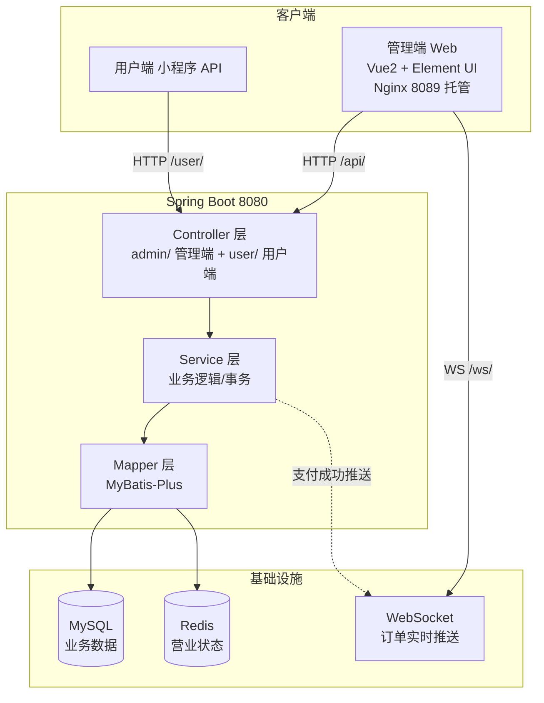
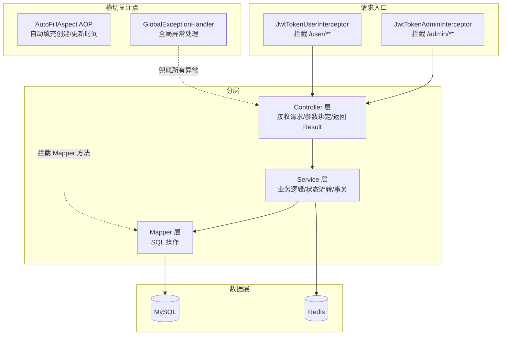
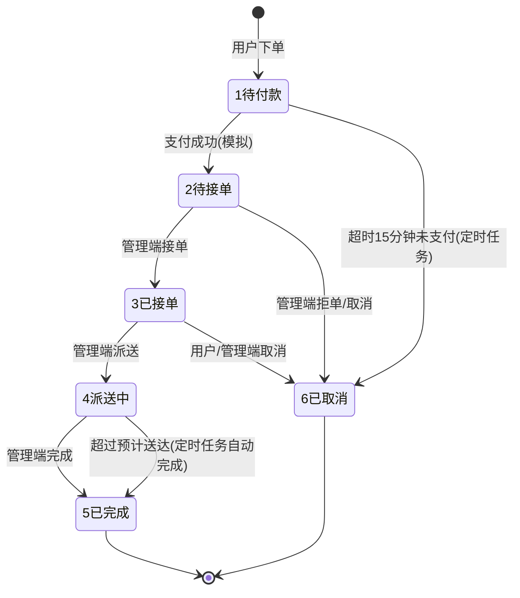
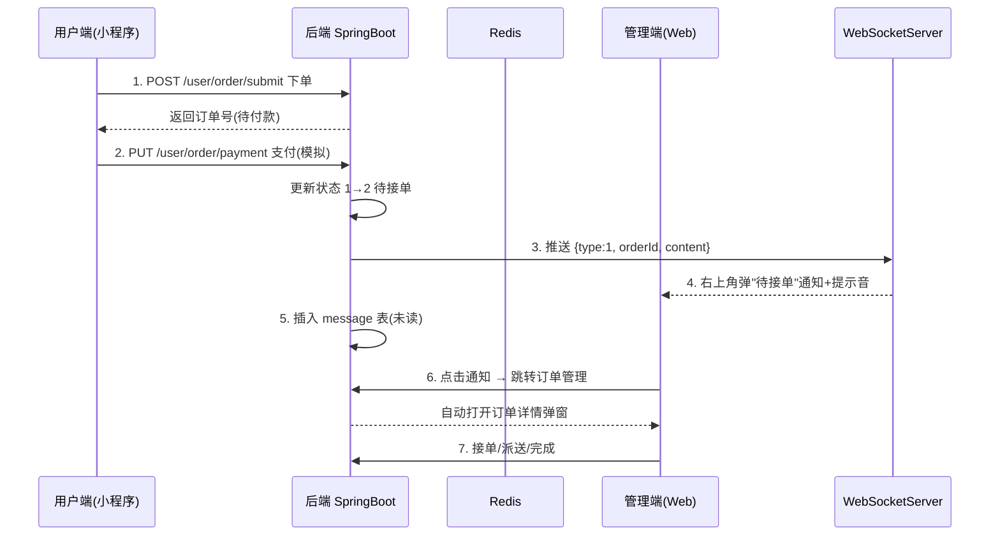
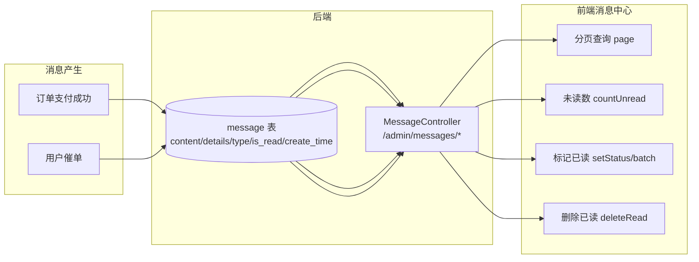
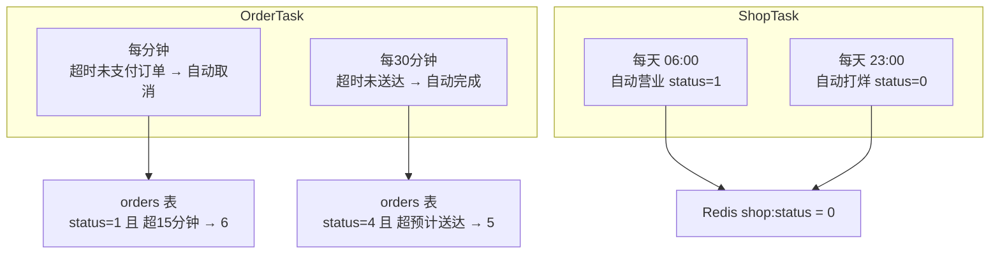
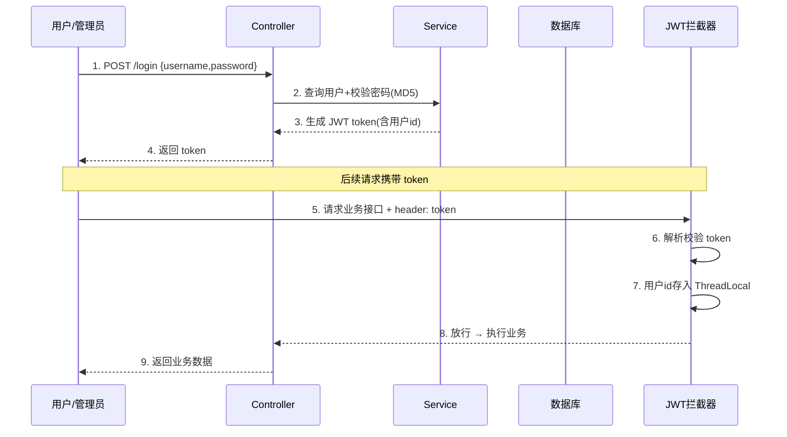
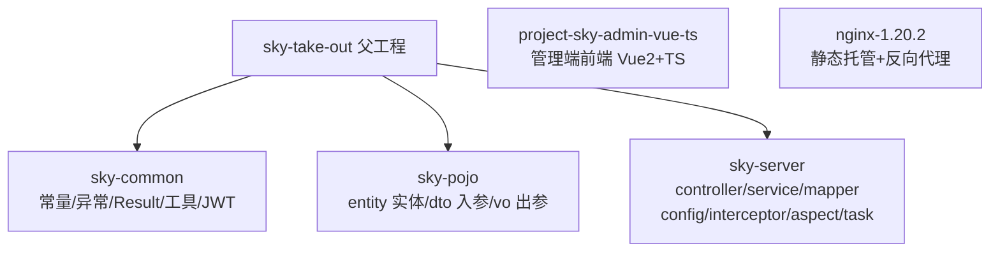

# 苍穹外卖 —— 架构图集

> 本文件包含项目全部架构图，用于 README 展示与项目讲解背诵。
> 使用 Mermaid 语法，GitHub 会自动渲染。

---

## 1. 系统总体架构图（一图看懂全貌）



**背诵要点**：两个客户端 → 一个 Spring Boot → 两个存储 + 一个推送通道。管理端走 nginx 托管静态页 + 反代 /api；用户端直接调 /user/ 接口。

---

## 2. 后端分层架构（面试必问三层架构）



**背诵要点**：请求先进拦截器（验 JWT）→ Controller → Service → Mapper → 数据库；AOP 横切 Mapper 自动填字段；全局异常处理器兜底。

---

## 3. 订单状态机（核心业务，必背）



**背诵要点**：正向流转 1→2→3→4→5，任意可取消到 6；两个定时任务兜底（超时未支付取消、超时未送达自动完成）。

---

## 4. 下单 → 实时通知 全流程时序（WebSocket 亮点）



**背诵要点**：支付成功双通道——WebSocket 实时弹窗（快）+ message 表持久化（消息中心可查）。

---

## 5. 消息中心设计（消息表 + 已读机制）



**背诵要点**：消息表字段（content/details/type/is_read/create_time），4 个接口（分页/未读/已读/删除），支付和催单是消息来源。

---

## 6. 定时任务设计（@Scheduled 兜底机制）



**背诵要点**：4 个定时任务两两一组——OrderTask 管订单兜底（取消/完成），ShopTask 管店铺开关（Redis 状态）。

---

## 7. 数据统计与报表导出（差异化亮点）

```mermaid
flowchart LR
    subgraph 数据来源
        D1[(orders 订单表)]
        D2[(user 用户表)]
        D3[(order_detail 明细表)]
    end

    subgraph ReportMapper [按天聚合 SQL]
        S1[营业额 sum(amount) where status=5]
        S2[用户数 count create_time]
        S3[订单数 count status]
        S4[TOP10 按 name 分组 sum(number)]
    end

    subgraph 接口
        A1[营业额统计]
        A2[用户统计]
        A3[订单统计]
        A4[销量 TOP10]
        A5[数据概览]
        A6[Excel 导出 POI]
    end

    D1 --> S1 --> A1
    D2 --> S2 --> A2
    D1 --> S3 --> A3
    D3 --> S4 --> A4
    A5 --> A1 & A2 & A3
    A6 --> A1
```

**背诵要点**：报表 = 按天分组的聚合 SQL；导出 = POI 动态建 Excel 文件写进响应流；前端 responseType:blob 接收下载。

---

## 8. 登录认证流程（JWT）



**背诵要点**：登录发 token → 拦截器验 token → ThreadLocal 存当前用户 → Controller 用 UserContext.getCurrentId() 拿用户。

---

## 9. 项目模块结构



**背诵要点**：Maven 三模块——common 工具、pojo 数据模型、server 业务；前端独立仓库，nginx 做托管和代理。
